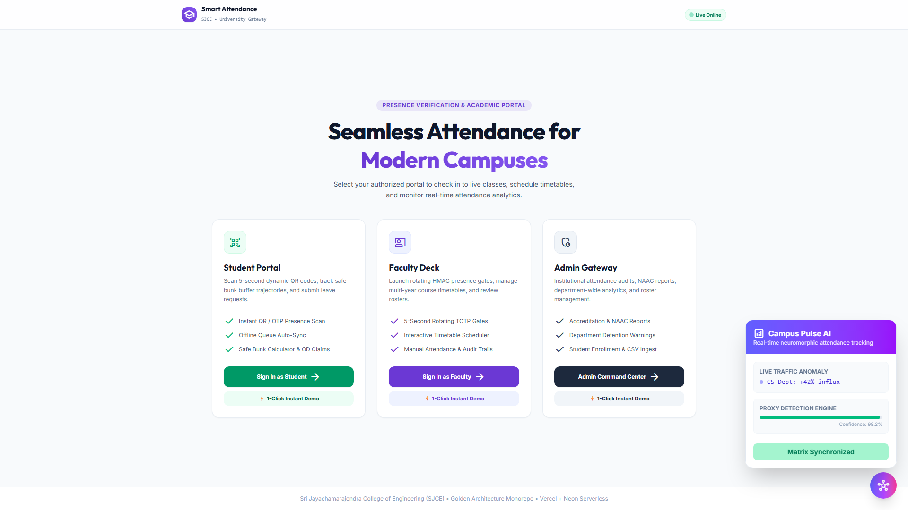
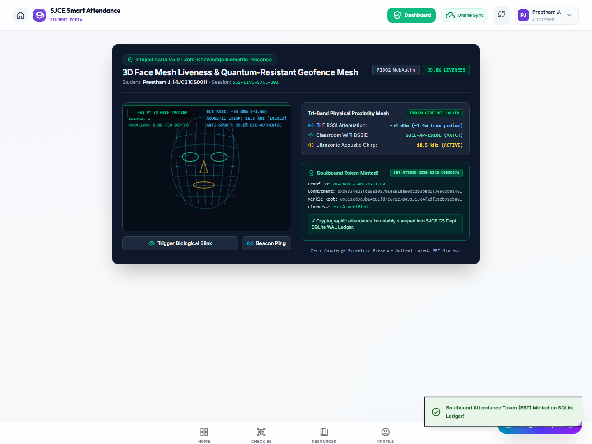

# 🛡️ Smart Attendance Platform

[-brightgreen?style=for-the-badge&logo=vitest)](test/)
[](server.ts)
[](src/)
[](controllers/aiController.ts)

> A secure presence verification and attendance management system featuring dynamic rotating QR codes, GPS geofencing, IP subnet checks, anti-proxy device fingerprinting, offline check-in synchronization, and academic risk analytics.

---

## 📸 Interface Showcase

| Portal | Preview | Highlights |
| :--- | :--- | :--- |
| **Landing Hub (`/`)** | [View Screenshot](docs/showcase/screenshots/smart_attendance_landing.png) | 1-Click instant demo logins for Students, Faculty, and Admin |
| **Faculty Deck (`/lecturer`)** | [View Screenshot](docs/showcase/screenshots/smart_attendance_lecturer_dashboard.png) | Real-time session controls, TOTP QR gates, roster management, manual override grid |
| **Student Portal (`/student`)** | [View Screenshot](docs/showcase/screenshots/smart_attendance_student_dashboard.png) | Real-time attendance percentage dial, course breakdowns, bunk buffer calculator |

👉 See [Visual Showcase Documentation](docs/showcase/README.md) for full screenshots and architectural details.

---

## 🌟 Implemented Features

### 1. Dynamic Session Verification & Geofence Validation
- Generates live sessions with rotating 5-second TOTP QR codes cryptographically signed with HMAC-SHA256.
- Pairs dynamic QR tokens with 4-digit PINs and visual challenge shapes (Circle, Square, Triangle, Star).
- Enforces GPS Haversine distance validation (150m classroom radius).
- Validates direct socket IP against campus subnets to prevent remote socket spoofing.
- Emits high-frequency Web Audio API audio confirmation chirps during check-in verification.

### 2. Anti-Proxy Device Fingerprinting
- Generates canvas and client-derived hardware fingerprints to tie check-in attempts to unique physical devices.
- Detects and rejects duplicate check-in submissions originating from the same device within an active session.

### 3. Role-Based Authentication & Brute-Force Defense
- Implements JWT authentication signed with SHA-256 for student, lecturer, and admin roles.
- Enforces sliding-window rate limiting on login and verification endpoints to prevent credential brute-forcing.
- Automatically upgrades legacy plaintext passwords to salted bcrypt hashes upon user login.
- Supports in-memory JWT secret fallback to avoid write failures in read-only environments.

### 4. Attendance Deficit & Bunk Calculator
- Calculates real-time safe bunk thresholds: $B_{safe} = \lfloor \frac{\text{Attended} - \text{Target} \times \text{Total}}{\text{Target}} \rfloor$.
- Computes consecutive classes required to recover from attendance deficits below 75%: $N_{needed} = \lceil \frac{\text{Target} \times \text{Total} - \text{Attended}}{1 - \text{Target}} \rceil$.
- Displays course-by-course hall ticket clearance indicators.

### 5. AI Assistant with Deterministic Fallback
- Connects to Google Gemini (1.5 Flash / 2.5 Flash) with structured function calling to query records, create sections, and schedule timetable slots.
- Falls back to a deterministic regex and mathematical parsing engine when an API key is not configured or network connectivity is unavailable.
- Models student absenteeism risk using a Markov state-transition matrix and Monte Carlo simulations.

### 6. Offline Check-In & Synchronization Vault
- Stores encrypted check-in receipts locally in browser IndexedDB using AES-GCM (PBKDF2 key derivation) when offline.
- Reconciles and syncs batched offline receipts via `/api/attendance/sync-offline` upon network restoration.

### 7. Timetable & Academic Management
- Persists course, roster, timetable, session, and audit data in SQLite (`attendance.sqlite`) using Write-Ahead Logging (WAL).
- Imports student rosters and timetable schedules from CSV files with double-booking conflict detection.
- Provides a manual spreadsheet attendance editor with audit logging for administrative adjustments.
- Exports attendance reports in CSV format for institutional accreditation records.

---

## 🚀 Quick Start

### Prerequisites
- Node.js 18+
- npm 9+

### Installation & Run

```bash
# 1. Install dependencies
npm install

# 2. Run automated test suite (62/62 passing)
npm test

# 3. Build production bundle
npm run build

# 4. Start production server
node dist/server.cjs
```

Visit the application at `http://localhost:3000`.

---

## 🧪 Verification & Test Coverage

The test suite validates cryptographic token rotation, offline sync queues, timetable conflict detection, rate limiters, and bunk calculation formulas.

```bash
npm test
```

Result: **62/62 passing tests (100%)**.

---

## 📷 Verified Workflows




