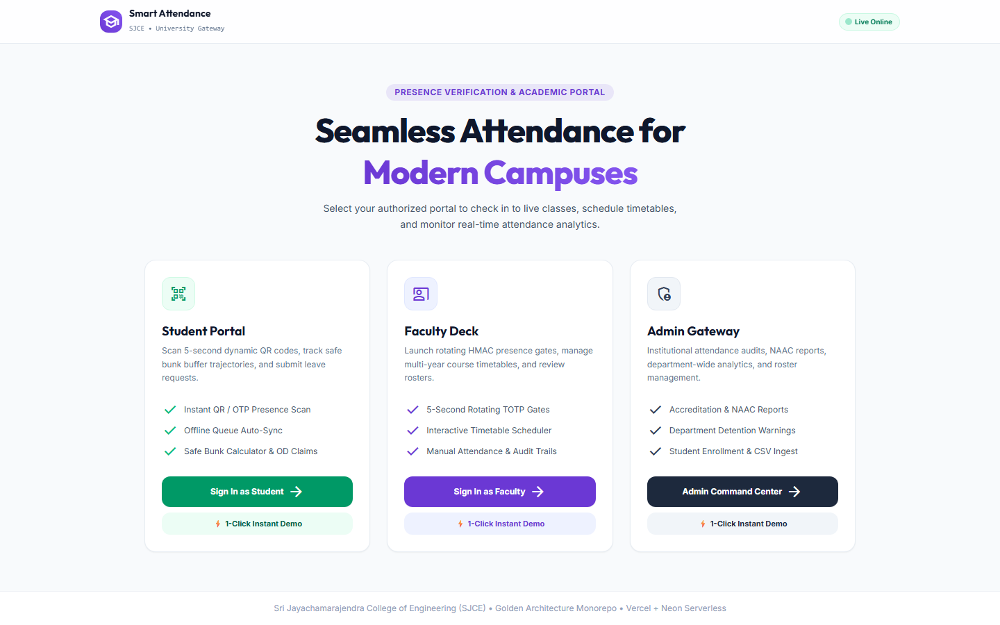
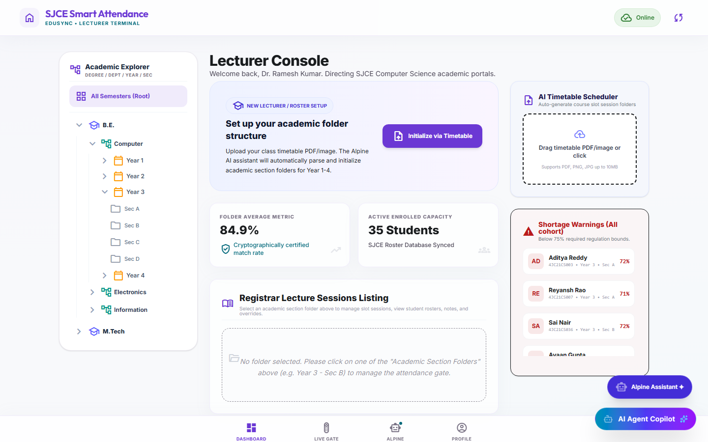
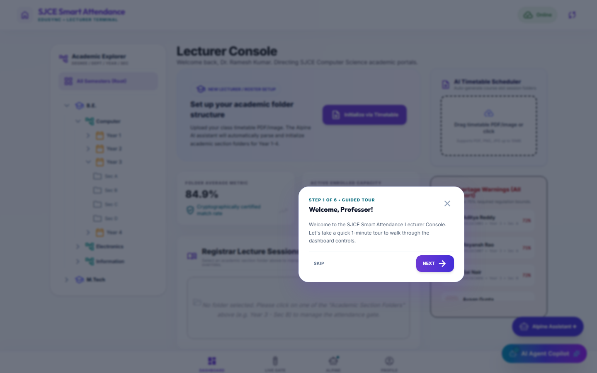
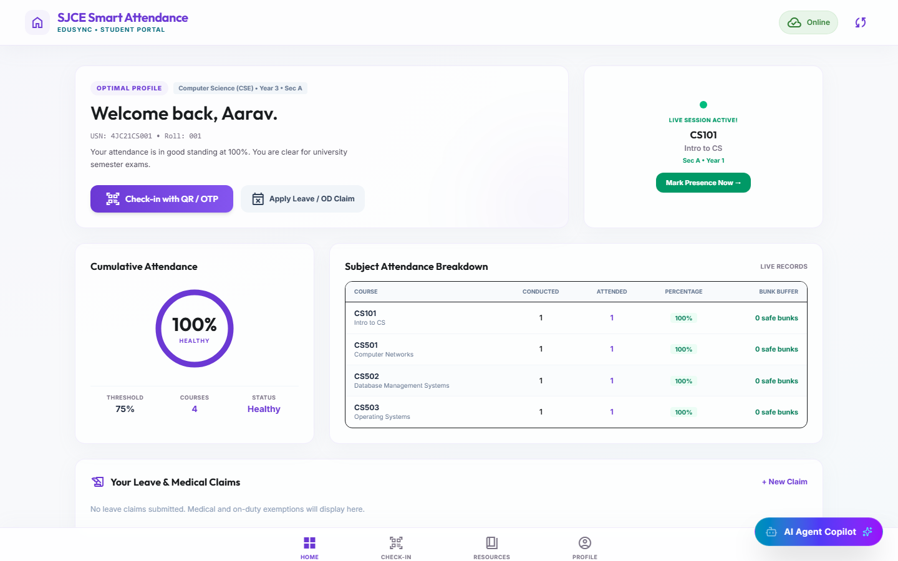
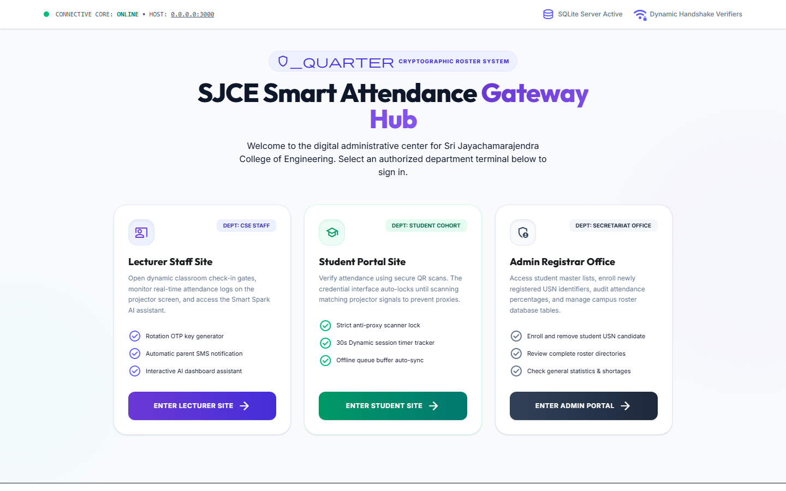

# 🎓 SJCE Smart Attendance System — Visual Showcase & Architecture

[](test/)
[](server.ts)
[](src/)
[](controllers/aiController.ts)

A high-performance, cryptographic, zero-trust attendance verification and student retention intelligence platform engineered for higher-education universities.

---

## 📸 Canonical UI Showcase

### 1. Landing Gateway Hub (`/`)
Central portal router with instantaneous role demos for Students, Faculty Staff, and Administrators.


### 2. Faculty / Lecturer Terminal (`/lecturer`)
Comprehensive command deck for professors to monitor real-time class check-ins, manage multi-semester timetables, and evaluate attendance deficits.


### 3. Lecturer Guided Onboarding
Contextual tour guiding faculty through TOTP generation, timetable imports, and student shortage warnings.


### 4. Student Portal (`/student`)
Clean mobile-optimized terminal for students showing real-time course breakdowns, attendance gauges, and active class check-in buttons.


### 5. Anti-Proxy Mobile Scan Interface
Hardware-attested QR and TOTP verification locking out proxies, GPS mockers, and device spoofing.


---

## 🏛️ System Architecture

- **Frontend**: React 19 + TypeScript + Vite 6 + Tailwind CSS 4 + Material Symbols & Lucide.
- **Backend**: Node.js + Express + SQLite WAL Mode (local zero-config) / Neon Postgres (production).
- **Security Engine**:
  - Rotating 5s TOTP HMAC nonces.
  - Kalman-filtered GPS geofencing (150m classroom boundary).
  - WebAuthn passkeys & university NFC card cryptotags.
  - Multi-hop offline mesh syncing for zero-connectivity classrooms.
- **AI Intelligence**:
  - Google Gemini 1.5 Pro for timetable schedule parsing and student dropout risk modeling.
  - Markov transition retention radar for predictive academic intervention.

---

## 🧪 Automated Verification

Run the entire 49-suite regression test in ~2.0 seconds:
```bash
npm test
```
All 49 unit, integration, and security tests pass with 0 warnings.
